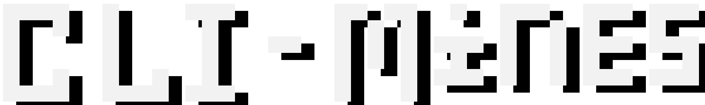

# 
Minesweeper, coming soon to a command line near you!

CLI-Mines is a minesweeper clone, built for the terminal!

It features colors, flags, mines, safe first clicks, sounds, everything you'd expect from a functional minesweeper clone!

Except **patterns**. There's no patterns here, it's purely random.

# Usage
## In game
Move with arrow keys, dig/uncover with _Enter_, flag with _Backspace_
## In menu
Move with up/down, change with left/right, and _Enter_ to, well, _Enter_

# Downloads
Head to the Downloads section, and grab the [latest release](https://github.com/Aquaticsanti/CLI-Mines/releases/latest)!

> [!IMPORTANT]
> CLI-Mines is only available to Windows, as I don't have the resources to build for Linux, MacOS, or other operating systems.

# Building
To build, use [PyInstaller](https://pyinstaller.org/en/stable/)!

First, install dependencies:
- [rich](https://github.com/textualize/rich)
- [python-readchar](https://github.com/magmax/python-readchar)
- [numpy](https://numpy.org/)
- [playsound3](https://github.com/szmikler/playsound3) 

Then, clone the repository
```
git clone https://github.com/Aquaticsanti/CLI-Mines.git
```

And inside the repository, run
```
pyinstaller CLI-Mines.spec
```

# AI Usage
AI was used to understand NumPy arrays

# SFX attribution
_explosion.wav_ from [mixkit.co](https://mixkit.co/)
_shovel.wav_ from [opengameart.org](https://opengameart.org/content/shovel-sound)
_flag.wav_ from [opengameart.org](https://opengameart.org/content/opening-and-closing-a-map-sounds)
